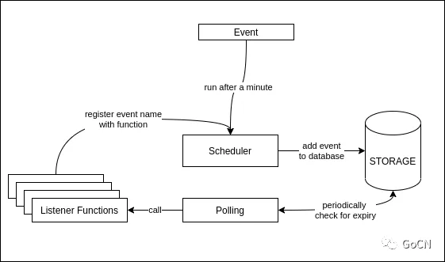

### 基于go 构建基础的事件调度器
> base: https://mp.weixin.qq.com/s/XZ_O14JLyFX9ppbqVHastw

#### 概述
创建一个时间为事件的调度器， 在固定的时间， 或者间隔运行任务， 比如定时发送邮件， 通知等等  
工作机制  
  
在这个调度器中， 使用数据库来作为事件存储
##### 自己理解
工作流程:
0. 创建调度事件event, 并注册事件调用的函数， 将事件保存到storage中
1. 监听器从storage中查询到期(到时间， 但未执行的)事件， 并放入队列中
2. 调度器从队列中拿到事件， 查询是否有注册调用函数， 如有， 使用注册函数，执行事件， 执行完成， 将storage中的事件标注 为已执行， 如无或失败， 则备注调用失败

#### Scheduler

#### Listeners

#### Storage
 [√] 通过定义接口， 实现后端存储在mysql 和 redis 的能力 


# Go Scheduler

这个项目是一个简单的Go语言实现的调度器。它使用MySQL数据库来存储和检索事件，并在指定的时间执行这些事件。

## 项目描述

这个项目包含以下主要部分：

- `initDBConnection`函数：初始化数据库连接。
- `Scheduler`结构体：包含数据库连接和事件监听器。
- `NewScheduler`函数：创建一个新的调度器实例。
- `Schedule`方法：在指定的时间安排一个事件。
- `AddListener`方法：添加一个事件监听器。
- `checkDataEvent`方法：检查是否有需要执行的事件。
- `callListener`方法：调用事件的监听器。
- `CheckEventsInInterval`方法：在给定的间隔内检查事件。

## 运行逻辑

1. 程序首先初始化数据库连接。
2. 创建一个新的调度器实例，并添加事件监听器。
3. 调用`CheckEventsInInterval`方法在每分钟检查一次事件。
4. 调用`Schedule`方法安排一个事件在一分钟后执行。
5. 当事件到达指定的时间，调度器会调用事件的监听器。

## 流程

1. 初始化数据库连接。
2. 创建调度器并添加监听器。
3. 安排一个事件。
4. 每分钟检查一次事件。
5. 当事件到达指定的时间，执行事件。

## 如何运行

你可以通过以下命令运行这个程序：

```shell
go run main.go
